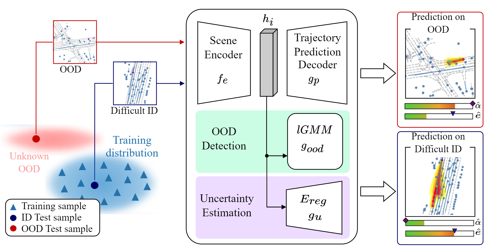

# Joint Out-of-Distribution Detection and Uncertainty Estimation for Trajectory Prediction

This is the official project page including the paper and the code.

**[Joint Out-of-Distribution Detection and Uncertainty Estimation for Trajectory Prediction](https://arxiv.org/abs/2308.01707)**
 
Julian Wiederer, Julian Schmidt, Ulrich Kressel, Klaus Dietmayer, Vasileios Belagiannis
 
*Accepted for presentation at [IROS 2023](https://ieee-iros.org/) in Detroit, MI, US.*
 

<!------>

